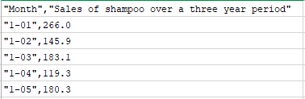

# Sales-Forecasting
Repository for Classical Forecasting Methods, Machine Learning and Deep Learning Models for Time Series Forecasting.The objective of case study is to compare various models with minimal feature engineering techniques.

Time series data is a series of data points measured at consistent time intervals which may be hourly, daily, weekly, every 10 days, and so on. In a time series data, each data point in the series depends on the previous data points.

In **multivariate, Time-Series** data, multiple variables will be varying over time. Each variable depends not only on its past values but also has some dependency on other variables. This dependency is used for forecasting future values. In **univariate, Time Series** data only one variable is varying over time.

Here we will address the problem using Classical Linear Models, Tree based algorithms, Ensemble Methods and Neural Network based Methods.

# Problem Statement
Your client is global shampoo manufacturer. The client has shared with you the demo data set and a data dictionary. The business is interested in understanding the drivers behind the shampoo consumption and are looking for data-driven recommendations for improving the sales.

# Data Description
This dataset describes the monthly sales of shampoo over a 3 year period. The units are a sales count and there are 36 observations. The original dataset is credited to Makridakis, Wheelwright and Hyndman (1998).



# Modeling Methods:

There are three classes of methods that might be interesting to explore on this problem; they are:

* Classical Forecasting Methods.
* Machine Learning Methods.
* Deep Learning Methods.

## Code

The solution is split into Exploratory data analysis and Model Building. 

Exploratory data analysis results are stored in below notebook.

1. `Exploratory data analysis.ipynb`

Below are the notebooks for Models:

1. `Machine Learning - Model 1.ipynb` for Non linear models
2. `Deep Learning - Model 1.ipyb` for Keras based linear regression
3. `Classical Linear Models.ipynb' for linear models

You need to have [Jupyter Notebook](http://ipython.org/notebook.html) installed to run the file

If you do not have Python installed yet, it is highly recommended that you install the [Anaconda](http://continuum.io/downloads) distribution of Python, which already has the above packages and more included. 

Before running the file, first install all necessary dependencies:

```
pip3 install -r requirements.txt
```

## Run

To run the notebook, open terminal or command window, navigate to the top-level project directory `Multivariate-Time-Series-Forecasting/` (that contains this README) and run one of the following commands:

```bash
ipython notebook Exploratory data analysis.ipynb
```  
or
```bash
jupyter notebook Exploratory data analysis.ipynb
```


